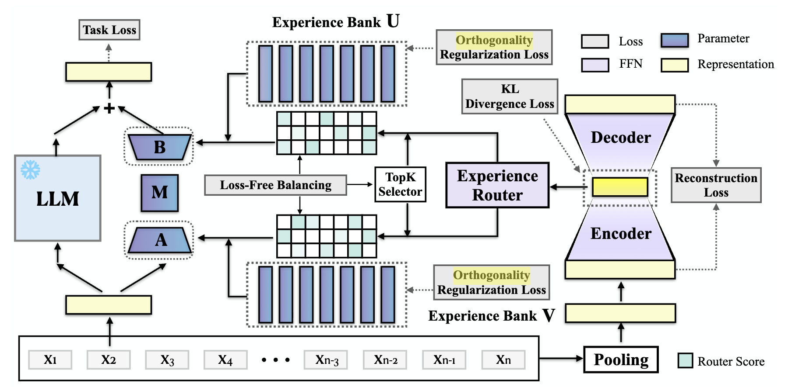
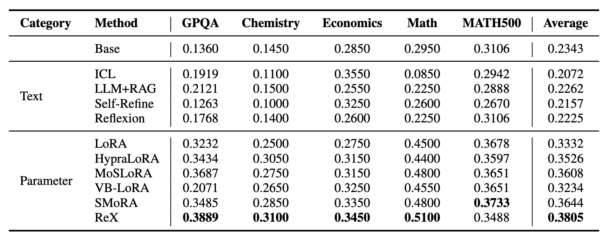

<div align="center">
<h2 align="center">
  <b>ReX: Reusable Experiences via Latent Routing and Modular Composition in LLMs</b>
</h2>
<div>
<a target="_blank" href="https://scholar.google.com/citations?user=DoXxoQIAAAAJ">Shuai&#160;Ling</a><sup>1,2</sup>,
<a target="_blank" href="https://scholar.google.com.sg/citations?user=W2b08EUAAAAJ&hl=en">Lizi&#160;Liao</a><sup>3</sup>,
<a target="_blank" href="https://scholar.google.com/citations?user=Awsue7sAAAAJ">Dongmei&#160;Jiang</a><sup>2&#9993;</sup>,
<a target="_blank" href="https://dblp.org/pid/236/2820.html">Weili&#160;Guan</a><sup>1&#9993;</sup>
</div>
<sup>1</sup>Harbin Institute of Technology (Shenzhen)&#160;&#160;
<sup>2</sup>Pengcheng Laboratory&#160;&#160;
<sup>3</sup>Singapore Management University
<br/>
<sup>&#9993;&#160;</sup>Corresponding authors
<br/>
<div align="center">
    <a href="#" target="_blank">
    </a>
    <a href="#" target="_blank">
    </a>
</div>
</div>

---

## Updates

- [04/2026] ReX Code released.

---

## Introduction

We propose **ReX** (**R**eusable **eX**perience), an experience-centric adaptation framework for LLMs. Existing approaches represent accumulated experience either as textual artifacts in prompts (limited by context windows) or as task-specific LoRA adapters (one adapter per task, no cross-task skill reuse). ReX treats *latent experiences* — recurring reasoning patterns and skills — as the fundamental unit of adaptation.

ReX constructs a shared **Experience Bank** of foundational skill vectors and employs a **VAE-based encoder** to map each input to a low-dimensional experience code. An **Experience Router** then dynamically selects and composes the most relevant skill vectors into a lightweight, instance-specific LoRA adapter — without any task identifiers or external metadata. By reusing skills across inputs, ReX achieves implicit knowledge sharing and improved generalization on multi-task NLP benchmarks.

---

## Framework



---

## Project Structure

```text
ReX/
├── configs/
│   ├── adapter/vaelora.json          # VAELoRA hyperparameters (r, r_b, d_z, topk, loss weights)
│   ├── data/
│   │   └── mix_data.json             # Multi-domain 10K training config
│   ├── quant/
│   │   ├── default.json              # 4-bit NF4 quantization (BitsAndBytes)
│   │   └── bf16.json                 # BF16 full-precision
│   ├── training/default.json         # Training hyperparameters
│   └── generation/default.json       # Generation settings (greedy, max_new_tokens)
├── custom_lora/vaelora/
│   ├── config.py                     # VAELoRAConfig — extends PeftConfig
│   ├── model.py                      # VAELoRAModel — BaseTuner implementation
│   ├── layer.py                      # VAELayer, VAELinear — per-layer trainable modules
│   ├── vae.py                        # VAEEncoder, VAEDecoder, TopkRouter, loss modules
│   ├── modeling_llama.py             # Modified Llama forward pass for VAELoRA injection
│   └── modeling_mistral.py           # Modified Mistral forward pass
├── scripts/train.sh                  # Example training commands
├── constant.py                       # Global paths and model/dataset constants
├── config_schemas.py                 # Dataclass configs for all pipeline components
├── data_processor.py                 # Dataset loading, tokenization, instruction masking
├── evaluation.py                     # Batch generation, metric computation, result saving
├── finetune_llm.py                   # Main entry point — training + post-training evaluation
├── evaluate_original_model.py        # Baseline (untuned) model evaluation
├── evaluate_peft_model.py            # Fine-tuned checkpoint evaluation
├── utils_funcs.py                    # Misc utilities (attn backend selection, config I/O)
├── utils_parser.py                   # Answer extraction and text normalization
├── utils_grader.py                   # Math equivalence grading (SymPy-based)
└── utils_math_normalization.py       # LaTeX-specific string normalization
```

---

## Installation

```bash
git clone [repo-url]
cd ReX
pip install torch transformers peft bitsandbytes accelerate
```

Flash Attention 2 (optional, auto-detected):

```bash
pip install flash-attn --no-build-isolation
```

---

## Configuration

Edit `constant.py` to set your local paths:

```python
HF_CACHE_DIR       = "/path/to/hf/models"
PROJECT_DATA_PATH  = "/path/to/training/datasets"
EVAL_DATASET_PATH  = "/path/to/eval/datasets"
RESULT_PATH        = "/path/to/results"
CODE_PATH          = "/path/to/ReX"
```

---

## Dataset

| Dataset | Domain | Train | Eval |
|---|---|---:|---:|
| [GPQA](https://huggingface.co/datasets/Idavidrein/gpqa) | Science (Bio/Phys/Chem) | Mix-Data | 198 |
| [MMLU-Pro Chemistry](https://huggingface.co/datasets/TIGER-Lab/MMLU-Pro) | Chemistry | Mix-Data | 200 |
| [MMLU-Pro Economics](https://huggingface.co/datasets/TIGER-Lab/MMLU-Pro) | Economics | Mix-Data | 200 |
| [MMLU-Pro Math](https://huggingface.co/datasets/TIGER-Lab/MMLU-Pro) | Mathematics | Mix-Data | 200 |
| [Math500 Level 3](https://huggingface.co/datasets/HuggingFaceH4/MATH-500) | Mathematics | Mix-Data | 500 |

Place datasets under `PROJECT_DATA_PATH` / `EVAL_DATASET_PATH`. Each file should be a JSON array with fields: `instruction`, `input`, `output`, `answer`.


---

## Usage

**Training — VAELoRA fine-tuning**

```bash
cd ReX
# Llama-3.2-3B-Instruct
python finetune_llm.py --model_name llama3.2-3b-instruct --output_dir outputs --data_config mix_data --adapter_name vaelora --adapter_config vaelora

# Llama-3.1-8B-Instruct
python finetune_llm.py --model_name llama3.1-8b-instruct --output_dir outputs --data_config mix_data --adapter_name vaelora --adapter_config vaelora

# Mistral-7B-Instruct
python finetune_llm.py --model_name mistral-7b-instruct   --output_dir outputs --data_config mix_data --adapter_name vaelora --adapter_config vaelora
```

Key arguments: `--target_modules` (0–4: FFN / attention / both), `--quant_config` (`default` 4-bit / `bf16`), `--training_config`, `--generation_config`, and any hyperparameter override (e.g., `--learning_rate 2e-4`).

**Evaluation — Baseline (untuned) model**

```bash
python evaluate_original_model.py \
    --model_name llama3.1-8b-instruct \
    --eval_dataset_names "gpqa,mmlupro_chemistry,mmlupro_economics,mmlupro_math,math500_level3"
```

**Evaluation — Fine-tuned checkpoint**

```bash
python evaluate_peft_model.py \
    --model_save_path /path/to/checkpoint
```

---

## Results




---

## License

This project is released under the [Apache License 2.0](https://www.apache.org/licenses/LICENSE-2.0).
